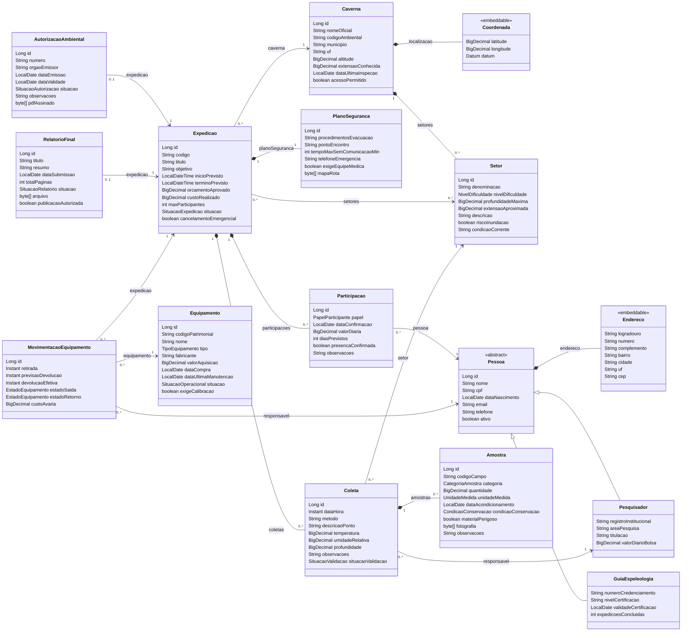

```mermaid
classDiagram
    direction LR

    class Coordenada {
        <<embeddable>>
        BigDecimal latitude
        BigDecimal longitude
        Datum datum
    }

    class Endereco {
        <<embeddable>>
        String logradouro
        String numero
        String complemento
        String bairro
        String cidade
        String uf
        String cep
    }

    class Caverna {
        Long id
        String nomeOficial
        String codigoAmbiental
        String municipio
        String uf
        BigDecimal altitude
        BigDecimal extensaoConhecida
        LocalDate dataUltimaInspecao
        boolean acessoPermitido
    }

    class Setor {
        Long id
        String denominacao
        NivelDificuldade nivelDificuldade
        BigDecimal profundidadeMaxima
        BigDecimal extensaoAproximada
        String descricao
        boolean riscoInundacao
        String condicaoCorrente
    }

    class Pessoa {
        <<abstract>>
        Long id
        String nome
        String cpf
        LocalDate dataNascimento
        String email
        String telefone
        boolean ativo
    }

    class Pesquisador {
        String registroInstitucional
        String areaPesquisa
        String titulacao
        BigDecimal valorDiarioBolsa
    }

    class GuiaEspeleologia {
        String numeroCredenciamento
        String nivelCertificacao
        LocalDate validadeCertificacao
        int expedicoesConcluidas
    }

    class Expedicao {
        Long id
        String codigo
        String titulo
        String objetivo
        LocalDateTime inicioPrevisto
        LocalDateTime terminoPrevisto
        BigDecimal orcamentoAprovado
        BigDecimal custoRealizado
        int maxParticipantes
        SituacaoExpedicao situacao
        boolean cancelamentoEmergencial
    }

    class PlanoSeguranca {
        Long id
        String procedimentosEvacuacao
        String pontoEncontro
        int tempoMaxSemComunicacaoMin
        String telefoneEmergencia
        boolean exigeEquipeMedica
        byte[] mapaRota
    }

    class AutorizacaoAmbiental {
        Long id
        String numero
        String orgaoEmissor
        LocalDate dataEmissao
        LocalDate dataValidade
        SituacaoAutorizacao situacao
        String observacoes
        byte[] pdfAssinado
    }

    class RelatorioFinal {
        Long id
        String titulo
        String resumo
        LocalDate dataSubmissao
        int totalPaginas
        SituacaoRelatorio situacao
        byte[] arquivo
        boolean publicacaoAutorizada
    }

    class Participacao {
        Long id
        PapelParticipante papel
        LocalDate dataConfirmacao
        BigDecimal valorDiaria
        int diasPrevistos
        boolean presencaConfirmada
        String observacoes
    }

    class Equipamento {
        Long id
        String codigoPatrimonial
        String nome
        TipoEquipamento tipo
        String fabricante
        BigDecimal valorAquisicao
        LocalDate dataCompra
        LocalDate dataUltimaManutencao
        SituacaoOperacional situacao
        boolean exigeCalibracao
    }

    class MovimentacaoEquipamento {
        Long id
        Instant retirada
        Instant previsaoDevolucao
        Instant devolucaoEfetiva
        EstadoEquipamento estadoSaida
        EstadoEquipamento estadoRetorno
        BigDecimal custoAvaria
    }

    class Coleta {
        Long id
        Instant dataHora
        String metodo
        String descricaoPonto
        BigDecimal temperatura
        BigDecimal umidadeRelativa
        BigDecimal profundidade
        String observacoes
        SituacaoValidacao situacaoValidacao
    }

    class Amostra {
        Long id
        String codigoCampo
        CategoriaAmostra categoria
        BigDecimal quantidade
        UnidadeMedida unidadeMedida
        LocalDate dataAcondicionamento
        CondicaoConservacao condicaoConservacao
        boolean materialPerigoso
        byte[] fotografia
        String observacoes
    }

    Caverna *-- Coordenada : localizacao
    Pessoa *-- Endereco : endereco
    Pessoa <|-- Pesquisador
    Pessoa <|-- GuiaEspeleologia

    Caverna "1" *-- "0..*" Setor : setores
    Expedicao "0..*" --> "1" Caverna : caverna
    Expedicao "0..*" --> "0..*" Setor : setores
    Expedicao "1" *-- "1" PlanoSeguranca : planoSeguranca
    AutorizacaoAmbiental "0..1" --> "1" Expedicao : expedicao
    RelatorioFinal "0..1" --> "1" Expedicao : expedicao
    Expedicao "1" *-- "0..*" Participacao : participacoes
    Participacao "0..*" --> "1" Pessoa : pessoa
    MovimentacaoEquipamento "0..*" --> "1" Expedicao : expedicao
    MovimentacaoEquipamento "0..*" --> "1" Equipamento : equipamento
    MovimentacaoEquipamento "0..*" --> "1" Pessoa : responsavel
    Expedicao "1" *-- "0..*" Coleta : coletas
    Coleta "0..*" --> "1" Setor : setor
    Coleta "0..*" --> "1" Pesquisador : responsavel
    Coleta "1" *-- "0..*" Amostra : amostras
```
